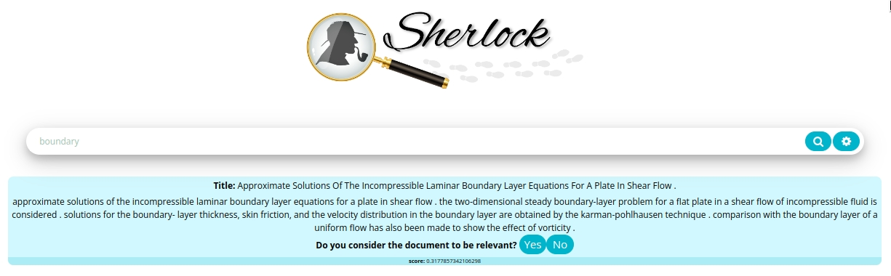

<center></center>

## Installation

```shell
make install
```

## Execution

From the root directory run in a terminal,

```shell
make python
```

and run this in another terminal.

```shell
make react
```

## Docker

You may not want to conflict with packages installed on your local computer, you can more easily build the docker image and run it with a container.

From the root directory runs from a terminal to lift the service,

```shell
make run-docker
```

and to close the service.

```shell
make stop-docker
```

Finally, enter the browser at the following web address [localhost:3000](http://localhost:3000).
